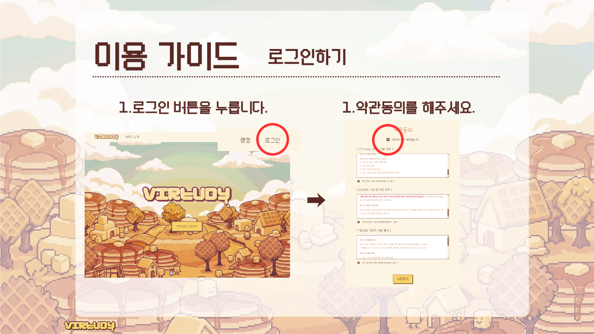

# 포팅 매뉴얼

생성일: 2026년 2월 9일 오전 7:47

# **1. Gitlab 소스 클론 이후 빌드 및 배포할 수 있도록 정리한 문서**

## **1. 사용한 JVM, 웹서버, WAS 제품 등의 종류와 설정 값, 버전 기재**

### **Backend (Spring Boot)**

- **Language / JVM:** Java 17 (Amazon Corretto 17)
- **Framework:** Spring Boot 3.5.9
- **Build Tool:** Gradle (Wrapper 포함)
- **WAS:** Spring Boot Embedded Tomcat
- **Base Image:** `amazoncorretto:17`

### **Frontend (Vue.js)**

- **Framework:** Vue 3 (+ Vite)
- **Web Server:** Nginx (Docker Image: `nginx:stable-alpine`)
- **Node Version (Reference):** Node.js 18+ (Required for build environment)
- **Nginx Configuration:** SPA Routing 지원 (`try_files $uri $uri/ /index.html`)

### **AI (Python)**

- **Language:** Python 3.11-slim
- **Framework:** FastAPI, Uvicorn
- **Major Libraries:** Torch 2.10.0, LiveKit 1.0.23, Ultralytics
- **Base Image:** `python:3.11-slim`
- **OS Dependencies:** `libgl1`, `libglib2.0-0` (OpenCV/MediaPipe 구동용)

### **Infrastructure (Docker)**

- **Orchestration:** Docker Compose
- **Message Broker:** Confluent Kafka 7.5.0, Zookeeper 7.5.0
- **Database:** MySQL 8.x (External or Host mapped), Redis
- **LiveKit:** LiveKit Server v1.8.0 (implied by library compatibility)

## **2. 빌드 시 사용되는 환경 변수 등의 내용 상세 기재**

### **Backend (`application.yml` / Docker Environment)**

빌드 및 실행 시 다음 환경 변수들이 application-dev.yaml 또는 **docker-compose.yml** 을 통해 주입되어야 합니다.

| **변수명** | **설명** | **예시 값** |
| --- | --- | --- |
| `SERVER_PORT` | WAS 포트 | `8080` |
| `SOCKET_PORT` | WebSocket 포트 | `8081` (예상) |
| `DEV_DB_HOST` | MySQL 호스트 | `host.docker.internal` |
| `DEV_DB_PORT` | MySQL 포트 | `3306` |
| `DEV_DB_NAME` | MySQL 데이터베이스명 | `virtudy` |
| `DEV_DB_USER` | MySQL 사용자명 | `root` |
| `DEV_DB_PASSWORD` | MySQL 비밀번호 | `****` |
| `REDIS_PORT` | Redis 포트 | `6379` |
| `DEV_REDIS_PASSWORD` | Redis 비밀번호 | `****` |
| `KAFKA_BOOTSTRAP_SERVERS` | Kafka 브로커 주소 | `kafka:29092` |
| `KAKAO_CLIENT_ID` | 카카오 로그인 API Key | `REST_API_KEY` |
| `KAKAO_CLIENT_SECRET_ID` | 카카오 로그인 Secret | `SECRET_KEY` |
| `JWT_SECRET_KEY` | JWT 서명 키 | `hs256_secret_key...` |
| `JWT_ACCESS_EXPMIN` | Access Token 만료(분) | `30` |
| `JWT_REFRESH_EXPMIN` | Refresh Token 만료(분) | `1440` |
| `LIVEKIT_URL` | LiveKit 서버 URL | `wss://your-livekit.io` |
| `LIVEKIT_API_KEY` | LiveKit API Key | `devkey` |
| `LIVEKIT_API_SECRET` | LiveKit API Secret | `secret` |
| `GMS_KEY` | Google Maps/Messaging Key | `AIza...` |
| `SPRING_PROFILES_ACTIVE` | 활성 프로파일 | `dev` |

### **AI Service**

| **변수명** | **설명** | **예시 값** |
| --- | --- | --- |
| `KAFKA_BOOTSTRAP_SERVERS` | Kafka 브로커 주소 | `kafka:29092` |
| `PYTHONPATH` | Python 경로 | `/app` |

## **3. 배포 시 특이사항 기재**

### **Docker / Infrastructure**

1. **네트워크 설정:**
    - Backend 컨테이너는 `host.docker.internal`을 사용하여 호스트 머신의 DB에 접근하도록 설정되어 있습니다 (**docker-compose.yml**). 배포 환경(EC2 등, Linux)에서는 `extra_hosts` 설정이 필요할 수 있으며, 프로덕션에서는 DB를 Docker Network 내부로 편입시키거나 고정 IP/DNS를 사용하는 것이 권장됩니다.
    - Kafka와 AI, Backend는 동일한 Docker Network 내에서 통신해야 합니다.
2. **Volume & Data:**
    - DB 데이터 영속성을 위한 Volume 설정이 **docker-compose.yml**에 명시되어 있지 않으므로(현재 확인된 파일 기준), 운영 배포 시 반드시 `volumes` 설정을 추가하여 데이터 유실을 방지해야 합니다.
3. **Frontend Build:**
    - Frontend는 `pnpm dev` 통해 `dist/` 폴더를 생성한 후, Docker 빌드 시 Nginx 이미지로 복사됩니다. 로컬 소스에 `dist/`가 있어야 Docker 빌드가 성공하는 구조이므로, **Docker 빌드 전 호스트에서 반드시 프론트엔드 빌드를 수행해야 합니다.** (Multi-stage build 아님).
4. **AI Service:**
    - `bestv7.pt` (모델 가중치 파일)이 Docker build context(`AI/ai_total/`) 내에 반드시 존재해야 합니다.

## **4. DB 접속 정보 등 프로젝트(ERD)에 활용되는 주요 계정 및 프로퍼티가 정의된 파일 목록**

다음 파일들은 DB 접속 정보, API Key, JWT Secret 등 민감 정보를 포함하고 있으므로 **외부 유출에 주의**해야 하며, 배포 시 환경 변수 주입 또는 보안 처리가 필요합니다.

### **Backend**

- `BE/src/main/resources/application-dev.yaml` (DB 계정, Redis 패스워드, JWT Key, Kafka 설정, LiveKit Key 등 핵심 정보 포함)
- `BE/src/main/resources/application-local.yaml` (로컬 개발용 설정)

### **Frontend**

- `FE/virtudy-frontend/.env.example` (공통 환경 변수 예시)
- `FE/virtudy-frontend/.env.production` (운영 환경 변수)

### **AI**

- `AI/ai_total/.env` (Python `python-dotenv` 사용 시 필요할 수 있음)

---

# 2. 프로젝트에서 사용하는 외부 서비스 정보를 정리한 문서

## **1. 소셜 인증 (Social Authentication)**

### **Kakao Login**

프로젝트는 카카오 로그인을 통해 사용자 인증을 처리합니다.

- **용도:** 사용자 회원가입 및 로그인, 사용자 프로필 정보(닉네임, 이미지) 조회
- **필요한 키 (Key):**
    - `KAKAO_CLIENT_ID` (REST API 키)
    - `KAKAO_CLIENT_SECRET_ID` (Client Secret)
- **설정 파일 위치:** **BE/src/main/resources/application-dev.yaml**
- **주요 엔드포인트:**
    - 인가 코드 요청: `https://kauth.kakao.com/oauth/authorize`
    - 토큰 발급: `https://kauth.kakao.com/oauth/token`
    - 사용자 정보 조회: `https://kapi.kakao.com/v2/user/me`
- **Redirect URI:**
    - 개발/운영 환경에 맞춰 Kakao Developers 콘솔에서 설정 필요 (예: `https://i14a703.p.ssafy.io/auth/kakao/callback`)

## **2. AI 및 외부 데이터 분석 (AI & Data Analysis)**

### **OpenAI (via SSAFY GMS Gateway)**

AI 분석 및 리포트 피드백 생성 기능을 위해 OpenAI GPT-4o 모델을 사용합니다. 보안 및 과금 관리를 위해 SSAFY 내부 GMS(Gateway Management System)를 경유합니다.

- **용도:**
    - 주간 리포트 코멘트 생성 (학습 데이터 기반 피드백)
    - 아바타 이미지 분석 (Vision API)
- **필요한 키 (Key):**
    - `GMS_KEY`: SSAFY GMS 인증 키 (Backend **application.yaml**에 설정)
    - `OPENAI_API_KEY`: AI 서비스(Python)에서 직접 호출 시 사용될 수 있으나, 현재 구조상 Backend는 GMS를 통해 호출하고, AI 서비스(**gpt_service.py**)도 `gms.ssafy.io`를 경유하도록 설정됨.
- **API Base URL:** `https://gms.ssafy.io/gmsapi/api.openai.com/v1`
- **사용 모델:** `gpt-4o`

---

## **3. 실시간 화상 및 통신 (Real-time Communication)**

### **LiveKit**

실시간 화상 회의 및 스터디 룸 기능을 위해 LiveKit 서버를 사용합니다.

- **용도:** 스터디 룸 내 화상/음성 채팅, 화면 공유
- **필요한 키 (Key):**
    - `LIVEKIT_URL`: LiveKit 서버 WebSocket 주소 (예: `wss://...`)
    - `LIVEKIT_API_KEY`: API 키
    - `LIVEKIT_API_SECRET`: API Secret 키
- **설정 파일 위치:** **BE/src/main/resources/application-dev.yaml**

## **4. 기타 외부 라이브러리/서비스 (Libraries & Tools)**

### **Google MediaPipe (Library)**

별도의 API 키가 필요하지 않은 클라이언트/서버 사이드 라이브러리입니다.

- **용도:**
    - **Frontend:** 웹캠 화상에서 얼굴/손 동작 인식 (졸음 탐지, 딴짓 탐지)
    - **AI Server:** 이미지 정밀 분석
- **비고:** 외부 서버 통신 없이 로컬(브라우저/서버)에서 추론 수행

### **Docker & Infrastructure**

- **Docker Hub / Base Images:**
    - `amazoncorretto:17` (Backend)
    - `nginx:stable-alpine` (Frontend)
    - `python:3.11-slim` (AI)
    - `confluentinc/cp-kafka`, `confluentinc/cp-zookeeper` (Message Broker)

---

# 3. DB 덤프 파일 최신본

[virtudy_dump.sql](virtudy_dump.sql)

- dump 파일 확인 바람

# 4. 시연 시나리오

